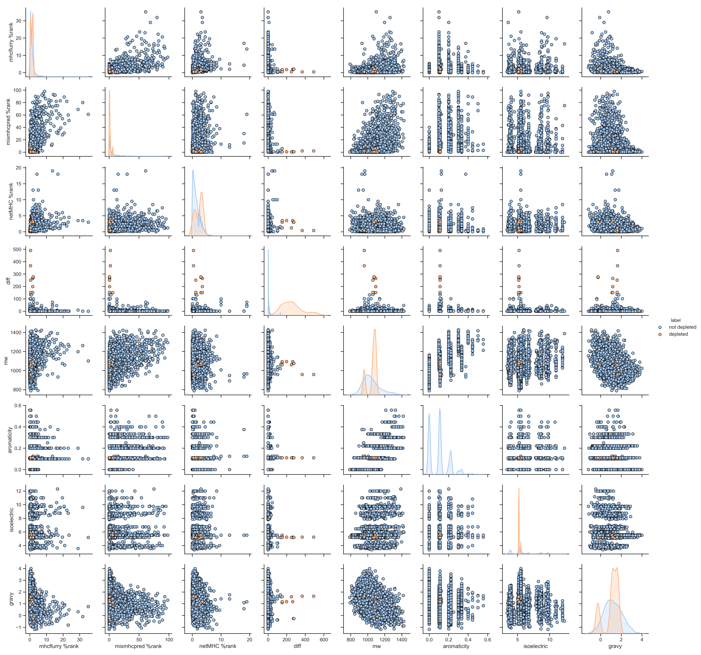

# PresentER-ML
Exploratory data anlysis of and training of a prediction tool for TCR off-target peptides from [PresentER](https://pubmed.ncbi.nlm.nih.gov/32184297/) screen data.

## Requirements
- Python libraries: `pandas`, `biopython`, `seaborn`, `numpy`, `mhctools`, `sklearn`
- Locally installed NetMHC4, MixMHCpred 

## Manifest
`assemble_df.py`: Reformats data from an investigator performing a PresentER screen in donor TCR-transduced T cells

`physicochemical_annotation.py`: Annotates each peptide with physicochemical properties (e.g. hydrophobicity, molecular weight, isoelectric point). Produces example plot of PresentER depletion score (diff) vs. molecular weight (mw) (peptide sequences redacted).

`binding_preds.py`: computes HLA-A*02:01 predicted binding for screened peptides using different MHC binding predictors
`physicochemical_preds.py`: Combines physicochemical annotations with binding prediction annotations.
`pairplot.py`: Visualization of peptide features in annotatated dataset that could principally underlie off-target character in PresentER screen.

`pca.py`: Produces PCA based on annotated dataframe.

`train_nb.py`: Train naive bayes classifier to predict if a given peptide will be depleted or not based on 2-grams
